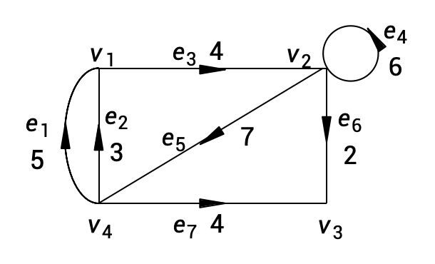

### 图 (Graph)

* 互连结点的集合
* **图模型**
    * 结点表示事物
    * 边表示事物之间的联系

### 图的表示

* 图G用一个二元组表示: $G=(V,E)$
* V表示**非空结点**(vertex)集合,
* E表示**边**(edge)的集合,每条边代表中的两个结点相关联。
* 对图G,用 $V(G)$ 和 $E(G)$ 表示该图的结点集和边集。
---
### 图的分类

* **无限图**: 结点集**或**边集是**无穷集合**;
* **有限图**: 结点集**和**边集均是**有限集合**;
    * 结点集 $V(G)=\{v_{1},v_{2},\cdot\cdot\cdot,v_{n}\}$
    * 结点数 $|V(G)|=n$
    * 边集 $E(G)=\{e_{1},e_{2},\cdot\cdot\cdot,e_{m}\}$
    * 边数 $|E(G)|=m$

* **无向图** : 所有的边是无向边
    * 无向边可记为无序的结点对 $e_{k}=(v_{i},v_{j})$
    * 结点 $v_{i}$ , $v_{j}$ 称为边 $e_{k}$ 的端点
    * 结点 $v_{i}$ 的邻集: $\Gamma(v_{i})=\{v_{j}|(v_{i},v_{j})\in E\}$

* **有向图**: 所有的边是有向边
    * 有向边可记为有序的结点对 $e_{k}=(v_{i},v_{j})$ 或 $e_{k}=\langle v_{i},v_{j}\rangle$
    * 结点 $v_{i}$ 为边 $e_{k}$ 的始点, $v_{j}$ 称为边 $e_{k}$ 的终点
    * 结点 $v_{i}$ 为 $v_{j}$ 的**直接前趋**, $v_{j}$ 为 $v_{i}$ 的**直接后继**
    * 结点 $v_{i}$ 的**前趋元集**(内邻集): $\Gamma^{-}(v_{i})=\{v_{j}|(v_{j},v_{i})\in E\}$（找节点前驱）
    * 结点 $v_{i}$ 的**后继元集**(外邻集): $\Gamma^{+}(v_{i})=\{v_{j}|(v_{i},v_{j})\in E\}$（找节点后继）
    * 结点 $v_{i}$ 的邻集: $\Gamma(v_{i})=\Gamma^{+}(v_{i})\cup\Gamma^{-}(v_{i})$

* **混合图**: 既有无向边也有有向边
* **多重图**: 有重边的图
    * **重边**: 两结点间的多条边
    * **自环**: 两结点重合的边, 即 $e_{k}=(v_{i},v_{i})$

* **简单图**: **无重边无自环**的**无向图**（三无图）
* **空图**: 无任何边的简单图, 记作 $N_{n}$
* **完全图**: 任意两结点都有边的简单图, 记作 $K_{n}$
---
### 结点的度

* **定义**: 记与结点关联的边数, 作 $d(v)$
* 自环对 $d(v)$ 的贡献度为2
* **有向图中结点的正度** 是以 $v$ 为**始点**的边的数目, 记作 $d^{+}(v)$（也就是出度）
* **有向图中结点的负度** 是以 $v$ 为**终点**的边的数目, 记作 $d^{-}(v)$（也就是入度）
* 有向图中结点的度 $d(v)=d^{+}(v)+d^{-}(v)$
* 度为0的结点称为 **孤立点**

### 度的基本性质

* 对于 $G(V,E)$, $|E|=m$, 则 $\Sigma_{v\in V(G)}d(v)=2m$;
* 图G中度为奇数的结点必有偶数个;
* 有向图中正度之和等于负度之和;
* $K_{n}$ 的边数 $m=\frac{1}{2}n(n-1)$ ;
* **非空简单图中一定存在度相同的结点**。

### 赋权图

* **定义**: 如果给图 $G=(V,E)$ 的每条边 $e_{k}$ 都赋以一个实数 $w_{k}$ 作为该边的权 $(weight)$, 则称G是赋权图。
* 如果权都是正数, 称为 **正权图**。
* 应用中往往是赋权图; 权可以表示长度、时间、费用等。
---
### 图的运算: 子图

* **定义**: 给定 $G=(V,E)$, 如果图 $G^{\prime}=(V^{\prime},E^{\prime})$ 满足 $V^{\prime}\subseteq V$, $E^{\prime}\subseteq E$, 则称图 $G^{\prime}$ 是G的 **子图**, 记作 $G^{\prime}\subseteq G$
* 如果 $V^{\prime}=V$ 则称 $G^{\prime}$ 是G的 **支撑子图** 或 **生成子图**。
* 如果 $V'\subseteq V$, 且对任意的 $v_{i}$, $v_{j}\in V^{\prime}$, 若 $e_{k}=(v_{i},v_{j})\in E$ ,有 $e_{k}\in E^{\prime}$, 则称 $G^{\prime}$ 是G的 **导出子图**。$E^{\prime}$ 包含了G在结点子集V'之间的所有边 ($E^{\prime}$ 是E中那些两个端点都在V'中的边构成的集合)。
* $G$ 的**平凡子图**: $G$ 和 $N_{n}$。
* **G是G的支撑子图、导出子图, 空图也是G的支撑子图**。

### 图的运算: 交、并、差、补和对称差

* 定义: 给定图 $G_{1}=(V_{1},E_{1})$ 和图 $G_{2}=(V_{2},E_{2})$,
* **交**: $G_{1}\cap G_{2}=(V_{1}\cap V_{2},E_{1}\cap E_{2})$
* **并**: $G_{1}\cup G_{2}=(V_{1}\cup V_{2},E_{1}\cup E_{2})$
* **差**: $G_{1}-G_{2}=(V_{1},E_{1}-E_{2})$ **如果出现孤立点, 孤立点删掉**
* **补**: $\overline{G_{1}}=K_{n}-G_{1}$
* **对称差**: $G_{1}\oplus G_{2}=(V_{1}\cup V_{2},E_{1}\oplus E_{2})$
    * $=(V_{1}\cup V_{2},(E_{1}-E_{2})\cup(E_{2}-G_{1}))$
    * $=(G_{1}-G_{2})\cup(G_{2}-G_{1})$
    * $=G_{1}\cup G_{2}-G_{1}\cap G_{2}$
* 结点在图中的可以独立存在, 但边只能关联结点而存在, 因此删除边不删除结点, 但删除结点则会删除该结点所关联的边。

* 从G中删去结点 $v$, 及其关联的边: $G-v$。 $G-v$ 是G的导出子图
* 从G中删去边e: $G-e$。 $G-e$ 是G的支撑子图
* 向G 中增加边 $e_{ij}=(v_{i},v_{j})$: $G+e_{ij}$

### 图的同构

* **定义**: 给定图 $G_{1}=(V_{1},E_{1})$ 及图 $G_{2}=(V_{2},E_{2})$, 如果在 $V_{1}$ 和 $V_{2}$ 之间存在 **双射** $f$ 使得
    * $(u,v)\in E_{1}$ iff $(f(u),f(v))\in E_{2}$
* 则称 $G_{1}$ 和 $G_{2}$ **同构 (isomorphic)**, 记作 $G_{1}\cong G_{2}$
* 形状不同、结构相同 (相同的点边关系)。
* 若 $G_{1}\cong G_{2}$, 则有:
    * $|V(G_{1})|=|V(G_{2})|$
    * $|E(G_{1})|=|E(G_{2})|$
    * $G_{1}$ 和 $G_{2}$ **结点度的非增序列**相同;
    * $G_{1}$ 和 $G_{2}$ 存在**同构的导出子图**(用于判断两个图是否同构, 十分有效)。
* 一个集合及其上的运算关系称为一个 **代数结构**。
* 两个代数结构 $A_{1}$ 和 $A_{2}$ 称为是同构的, 如果同时满足以下两个条件:
    1.  有 $A_{1}$ 和 $A_{2}$ 的集合元素之间存在一一映射 $\sigma:A_{1}\rightarrow A_{2}$
    2.  在映射作用下, 原像集合 $A_{1}$ 的元素运算关系, 保持到了像集合 $A_{2}$
* 在本节中, 图的同构所指的运算关系是点边关系 $e=(u,v)$, 也称为 **点边同构**。

#### 简单图的同构

* 两个简单图 $G_{1}=(V_{1},E_{1})$ 和 $G_{2}=(V_{2},E_{2})$ 称为是(点边)同构的, 如果同时满足以下两个条件:
    1.  两个结点集合 $V_{1}$ 和 $V_{2}$ 之间存在一一映射: $\sigma:V_{1}\rightarrow V_{2}$;
    2.  在映射作用下, $G_{1}$ 中的点边关系保持到了 $G_{2}$:
        * 对任意 $u,v\in V_{1}:(u,v)\in E_{1}\Leftrightarrow(\sigma(u),\sigma(v))\in E_{2}$

#### 一般图的同构

* 两个图 $G_{1}=(V_{1},E_{1})$ 和 $G_{2}=(V_{2},E_{2})$ 称为是(点边)同构的, 如果同时满足以下两个条件:
    1.  图 $G_{1}=(V_{1},E_{1})$ 和 $G_{2}=(V_{2},E_{2})$ 之间存在两个一一映射:
        * $\sigma: V_{1}\rightarrow V_{2}$, $\varphi:E_{1}\rightarrow E_{2}$;
    2.  在映射和作用下, $G_{1}$ 中的点边关系保持到了 $G_{2}$:
        * 对任意 $u,v\in V_{1}$ : $e=(u,v)\in E_{1}\iff\varphi(e)=(\sigma(u),\sigma(v))\in E_{2}$。
* 在有重边的情形下, $e=(u,v)$ 只是表达“e的端点分别为u,v”。
* 从定义可以看到, 图的同构是一种**等价关系**。
:::note
目前唯一的判别法就是：不考虑图的标记的情况下, 这两个图在适当移动顶点和边之后有相同的直观表示。
:::

---

### 图的代数表示: 邻接矩阵

* 描述结点之间关系
* 图 $G=(V,E)$ 的邻接矩阵是一个 $n\times n$ 矩阵A, 其元素为:
    $a_{ij}=\begin{cases}1,&(v_{i},v_{j})\in E,\\ 0,&otherwise\end{cases}$
* **邻接矩阵可以表示自环, 但不能表示重边**。
* 无向图的邻接矩阵是对称阵;
* 简单图邻接矩阵的第i行之和为结点的度。
* 有向图的邻接矩阵的第i行之和为结点 $v_{i}$ 的正度,
* 第j列之和为结点 $v_{j}$ 的负度。
:::note
注意矩阵的行和列都表示结点，行为出，列为入。
:::

### 图的代数表示: 权矩阵

* 赋权图 $G=(V,E)$ 的权矩阵是一个 $n\times n$ 矩阵A, 其元素为:
    $a_{ij}=\begin{cases}w_{ij},&(v_{i},v_{j})\in E,\\ 0,&otherwise\end{cases}$
::: note
就是把邻接矩阵的 1 换成权。
:::
### 图的代数表示: 关联矩阵

* 描述结点与边之间关系
* **有向图** $G=(V,E)$ 的关联矩阵是一个 $n\times m$ 矩阵B, 其元素为:
    $b_{ij}=\begin{cases}1,&e_{j}=(v_{i},v_{k})\in E,\\ -1,&e_{j}=(v_{k},v_{i})\in E,\\ 0,&otherwise.\end{cases}$
* 每列只有两个非零元素: 1和-1;
* 第i行非零元素数为结点 $v_{i}$ 的度 $d(v_{i})$, 其中1的个数是 $d^{+}(v_{i})$, -1的个数是 $d^{-}(v_{i})$;
* **关联矩阵可表示重边, 但不能表示自环**。
* **无向图** $G=(V,E)$ 的关联矩阵是一个 $n\times m$ 矩阵B, 其元素为:
    $b_{ij}=\begin{cases}1,&e_{j}=(v_{i},v_{k})\in E,\\ 0,&otherwise.\end{cases}$
:::note
行表示结点，列表示边。无向图都是 1，有向图有正负 1。
:::

### 图的代数表示: 邻接表

* 描述结点与边的关系，是图的一种链式存储结构
* **结构**:
    * 包含一个大小为 $n$ (结点数) 的数组，数组的每个元素 $i$ 对应结点 $v_i$。
    * 数组的每个元素 $i$ 指向一个链表。
    * 该链表存储了所有与结点 $v_i$ 相关联的边（或邻接结点）。
* 可以表示重边

### 图的代数表示: 正向表

* 有向图的正向表由一个 $n+1$ 维向量A和一个 $m$ 维向量B组成，如果是赋权图，可以增加一个 $m$ 维向量Z表示权值。
* 构造正向表：
    * 首先根据顶点的顺序，将 $v_1, \dots, v_n$ 的所有直接后继列举出来，组成向量B。
    * 然后构造向量A：每个 $A(i)$ 为 $v_i$ 的第一个直接后继在B中的地址，$A(n+1) = m+1$。
    * 对于赋权图，令 $Z(i)$ 为边 $e = (v_j, v_{B(i)})$ 的权重，其中 $j$ 为 $B(i)$ 在A中对应的编号，即 $A(j) \le i < A(j+1)$。
* 更具体地，正向表中的列表A满足：
    * $d^+(v_i) = A(i+1) - A(i)$;
    * $A(i) = \sum_{j=1}^{i-1} d^+(v_j) + 1$
* 例子：右图的正向表为：

	* A: (1 2 5 5 8)
    * B: (2 2 3 4 1 3 3)
    * Z: (4 6 2 7 4 5 3)
* 对于无向图，B中存放所有顶点的相邻顶点的编号，故B的维数是 $2m$ 而非 $m$。

# 逆向表

* 逆向表和正向表相反，将有向图每个顶点的直接前趋集中存放。
* 例子：正向表附图的逆向表为：

	* A: (1 3 5 7 8)
    * B: (4 4 1 2 2 4 4)
    * Z: (5 3 4 6 2 4 7)
* 正向表和逆向表可以看做是对邻接矩阵分别按照行和列进行压缩的结果。

# 边列表

* 边列表由两个 $m$ 维向量A, B组成。
* 若 $e_k = (v_i, v_j)$，则 $A(k)=i, B(k)=j$。
* 若G是赋权图，则增加向量Z，$Z(k) = w_k$。
* 例子：依然是上面那个图所示的边列表为：
    * A: (4 4 1 2 2 4 4)
    * B: (1 1 2 2 4 3 3)
    * Z: (5 3 4 6 7 2 4)
* 对于无向图，我们可以约定 $A(k) \le B(k)$，使得图表示形式唯一。
